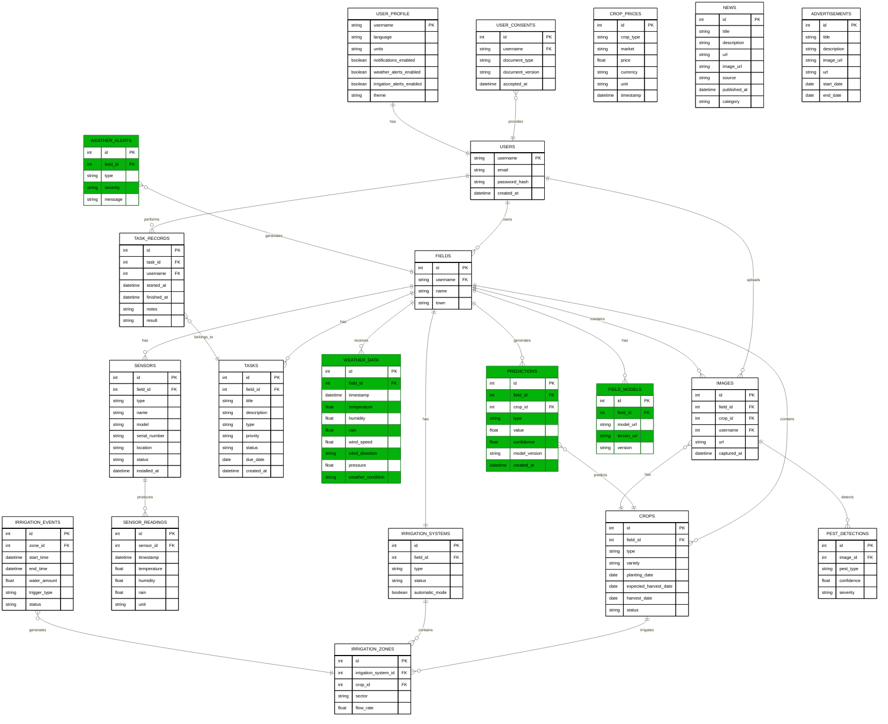

```mermaid
%%{
  init: {
    'theme': 'base',
    'themeVariables': {
      'fontSize': '240px'
    },
    'themeCSS': `
      .er.relationshipLine {
        stroke-width: 5px !important;
      }

      .er.relationshipLabel {
        font-size: 100px !important;
      }

      .er.entityBox {
        stroke-width: 4px !important;
      }
    `
  }
}%%
erDiagram

    USERS {
        string username PK
        string email 
        string password_hash
        datetime created_at
    }

    USER_PROFILE {
        string username PK
        string language
        string units
        boolean notifications_enabled
        boolean weather_alerts_enabled
        boolean irrigation_alerts_enabled
        string theme
    }
    
    USER_CONSENTS {
        int id PK
        string username FK
        string document_type
        string document_version
        datetime accepted_at
    }


    FIELDS {
        int id PK
        string username FK
        string name
        string town
    }

    CROPS {
        int id PK
        int field_id FK
        string type
        string variety
        date planting_date
        date expected_harvest_date
        date harvest_date
        string status
    }

    SENSORS {
        int id PK
        int field_id FK
        string type
        string name
        string model
        string serial_number
        string location
        string status
        datetime installed_at
    }

    SENSOR_READINGS {
        int id PK
        int sensor_id FK
        datetime timestamp
        float temperature
        float humidity
        float rain
        string unit
    }

    TASKS {
        int id PK
        int field_id FK
        string title
        string description
        string type
        string priority
        string status
        date due_date
        datetime created_at
    }

    TASK_RECORDS {
        int id PK
        int task_id FK
        int username FK
        datetime started_at
        datetime finished_at
        string notes
        string result
    }

    IRRIGATION_SYSTEMS {
        int id PK
        int field_id FK
        string type
        string status
        boolean automatic_mode
    }

    IRRIGATION_ZONES {
        int id PK
        int irrigation_system_id FK
        int crop_id FK
        string sector
        float flow_rate
    }

    IRRIGATION_EVENTS {
        int id PK
        int zone_id FK
        datetime start_time
        datetime end_time
        float water_amount
        string trigger_type
        string status
    }

    WEATHER_DATA {
        int id PK
        int field_id FK
        datetime timestamp
        float temperature
        float humidity
        float rain
        float wind_speed
        string wind_direction
        float pressure
        string weather_condition
    }

    WEATHER_ALERTS {
        int id PK
        int field_id FK
        string type
        string severity
        string message
    }

    IMAGES {
        int id PK
        int field_id FK
        int crop_id FK
        int username FK
        string url
        datetime captured_at
    }

    PEST_DETECTIONS {
        int id PK
        int image_id FK
        string pest_type
        float confidence
        string severity
    }

    PREDICTIONS {
        int id PK
        int field_id FK
        int crop_id FK
        string type
        float value
        float confidence
        string model_version
        datetime created_at
    }

    CROP_PRICES {
        int id PK
        string crop_type
        string market
        float price
        string currency
        string unit
        datetime timestamp
    }

    NEWS {
        int id PK
        string title
        string description
        string url
        string image_url
        string source
        datetime published_at
        string category
    }

    ADVERTISEMENTS {
        int id PK
        string title
        string description
        string image_url
        string url
        date start_date
        date end_date
    }

    FIELD_MODELS {
        int id PK
        int field_id FK
        string model_url
        string terrain_url
        string version
    }

    %% RELACIONS

    USERS ||--o{ FIELDS : owns
    USERS ||--o{ TASK_RECORDS : performs
    USERS ||--o{ IMAGES : uploads


    USER_CONSENTS }o--|| USERS : provides
    USER_PROFILE ||--||  USERS : has
    
    FIELDS ||--o{ SENSORS : has
    FIELDS ||--o{ TASKS : has
    FIELDS ||--o{ WEATHER_DATA : receives
    FIELDS ||--o{ CROPS : contains
    FIELDS ||--|| IRRIGATION_SYSTEMS : has
    FIELDS ||--o{ IMAGES : contains
    FIELDS ||--o{ PREDICTIONS : generates
    FIELDS ||--o{ FIELD_MODELS : has

    SENSORS ||--o{ SENSOR_READINGS : produces

    CROPS ||--o{ IRRIGATION_ZONES : irrigates

    PREDICTIONS }o--|| CROPS : predicts
    TASK_RECORDS }o--|| TASKS : belongs_to
    

    IRRIGATION_SYSTEMS ||--o{ IRRIGATION_ZONES : contains
    IRRIGATION_EVENTS }o--|| IRRIGATION_ZONES   : generates

    IMAGES ||--o{ PEST_DETECTIONS : detects
    IMAGES }o--|| CROPS : has
    
    WEATHER_ALERTS  }o--|| FIELDS  : generates
    
    classDef verd fill:#04B309,stroke:#2E7D32,color:#000
    classDef blanc fill:#FFFFFF,stroke:#000000,color:#000

    class USERS,USER_CONSENTS,USER_PROFILE,FIELDS,CROP_PRICES,NEWS,ADVERTISEMENTS,SENSOR_READINGS, TASK_RECORDS, CROPS, PEST_DETECTIONS, IMAGES, TASKS,SENSORS, IRRIGATION_EVENTS, IRRIGATION_SYSTEMS,IRRIGATION_ZONES  blanc
    class FIELD_MODELS, WEATHER_ALERTS,WEATHER_DATA,PREDICTIONS verd
```